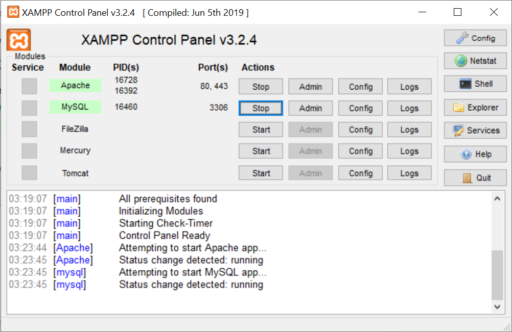
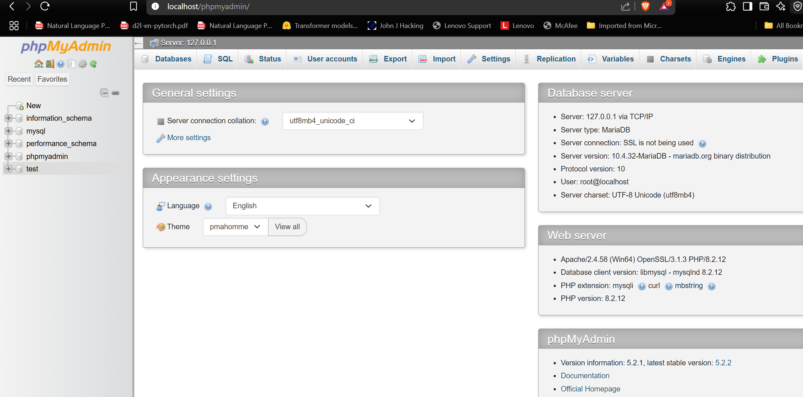
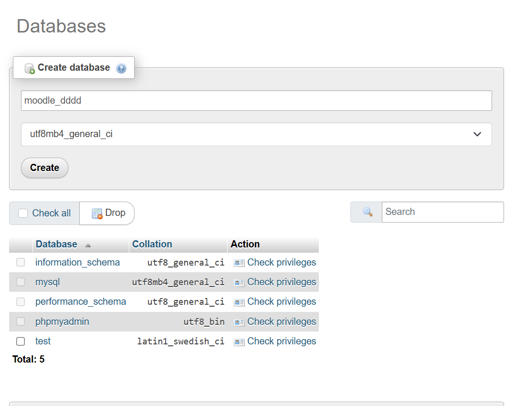

# Moodle Experiments

Need to add 360 module

https://www.bing.com/videos/riverview/relatedvideo?&q=how+to+install+and+set+up+moodle&&mid=07264DD74C73700F824607264DD74C73700F8246&mmscn=mtsc&aps=399&FORM=VRDGAR

## installing C++ libararies

https://download.microsoft.com/download/1/6/b/16b06f60-3b20-4ff2-b699-5e9b7962f9ae/VSU_4/vcredist_x64.exe

## installing moodle latest

https://download.moodle.org/releases/latest/

https://download.moodle.org/download.php/stable500/moodle-5.0.zip

## installing xampp

https://sourceforge.net/projects/xampp/

once instllaed control panel should look like

Switch on apache and mysql

### opening phpmyadmin

### Moodle_dddd database created

moodle_dddd

# trying moodle

https://www.youtube.com/watch?v=NXGV98RsBLY&t=46s

Login as an administrator

prompt

in moodle I want to orchestrate test taking in multiple subjects in which each may have individual units and their associated quizzes. Now this moodle will be hosted for multiple organisations with multiple employees. They all have to undertake different subjects as per the employee specification. SO when a new organisation comes to give an exam, it should have a mechanism to input its documents and enroll its employees to different subjects and quizzes related to subject. I want to modify moodle platform to achieve this - ability to input documents at a place for examiner by the organisation and ability to add same subject to different employees based on their specialisation. help me flesh out this though process use diagrams if necessary, give me a concrete action plan how to go about doing this. I want a beginner firendly explanation who just knows a little bit about moodle and want sot build it using free tools.further i need simple photo based free plugins for proctoring as well. I am desigining this for my organisation so i want it to be robust, efficient and future proof. please validate my request and tell

